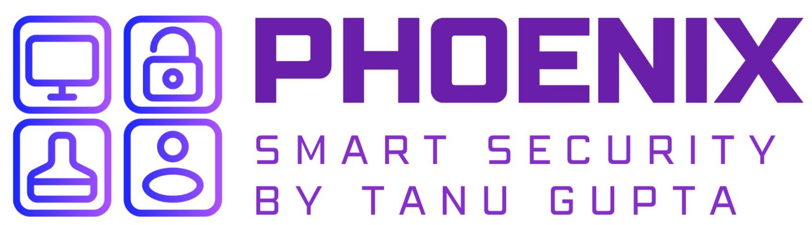

# Independent Audit Reports

| Audit Start | Audit End  | Report                                                                      | Conducted By | Tech                                        | C   | H   | M   | L   | I   | G   |
| ----------- | ---------- | --------------------------------------------------------------------------- | ------------ | ------------------------------------------- | --- | --- | --- | --- | --- | --- |
| 2025-10-8   | 2025-10-23 | [Sequence Wallet](./reports/2025-11-04-sequence-code4rena.pdf)              | Code4rena    | ERC4337, Account Abstraction, Smart Wallet  | n/a | 3   | 5   | 11  | 2   | 0   |
| 2025-08-20  | 2025-08-23 | [Vault Guardian Protocol](./reports/2025-08-23-vaultGuardian-protocol.pdf)  | Cyfrin       | DEX, Leverage Trading, Vault, Uniswap, AAve | n/a | 10  | 2   | 7   | 5   | 0   |
| 2025-08-12  | 2025-08-13 | [Bridge Protocol](./reports/2025-08-13-bridge-protocol.pdf)                 | Cyfrin       | L2, Cross-Chain, Bridge                     | n/a | 6   | 1   | 2   | 3   | 0   |
| 2025-08-03  | 2025-08-04 | [Last Man Standing Protocol](./reports/2025-08-04-lastManStanding-game.pdf) | CodeHawks    | Game theory, EVM                            | n/a | 1   | 1   | 2   | 1   | 2   |
| 2025-07-28  | 2025-07-30 | [Thunder Loan Protocol](./reports/2025-07-30-thunder-loan.pdf)              | CodeHawks    | Defi Lending, Borrowing, Flash Loan         | n/a | 3   | 1   | 2   | 0   | 0   |
| 2025-07-21  | 2025-07-22 | [TSwap Protocol](./reports/2025-07-22-t-swap-protocol.pdf)                  | Cyfrin       | UniswapV3 Fork, DEX/AMM                     | n/a | 4   | 2   | 2   | 10  | 1   |
| 2025-07-20  | 2025-07-21 | [Beatland Festival](./reports/2025-07-21-beatland-festival.pdf)             | CodeHawks    | NFT, ERC 712, ERC115, ERC20                 | n/a | 2   | 2   | 3   | 1   | 1   |
| 2025-07-08  | 2025-07-10 | [Puppy Raffle](./reports/2025-07-10-puppyRaffle.pdf)                        | Cyfrin       | Lottery, NFT                                | n/a | 3   | 3   | 1   | 7   | 2   |
| 2025-07-07  | 2025-07-7  | [Order Book](./reports/2025-07-07-orderBook.pdf)                            | CodeHawks    | Trading, lending, borrowing                 | n/a | 2   | 3   | 3   | 1   | 0   |
| 2025-06-27  | 2025-06-27 | [Password Store](./reports/2025-06-27-passwordStore-report.pdf)             | Cyfrin       | Password Manager                            | n/a | 2   | 0   | 0   | 1   | 0   |
